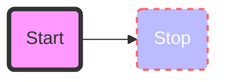
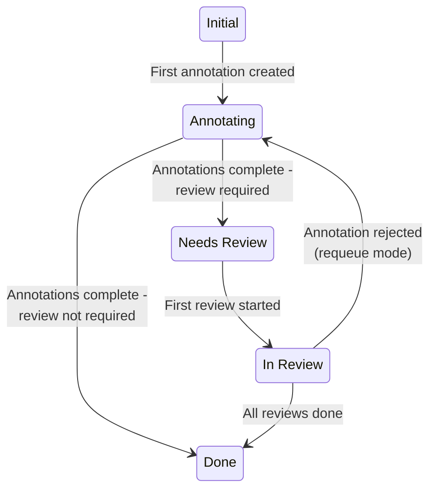
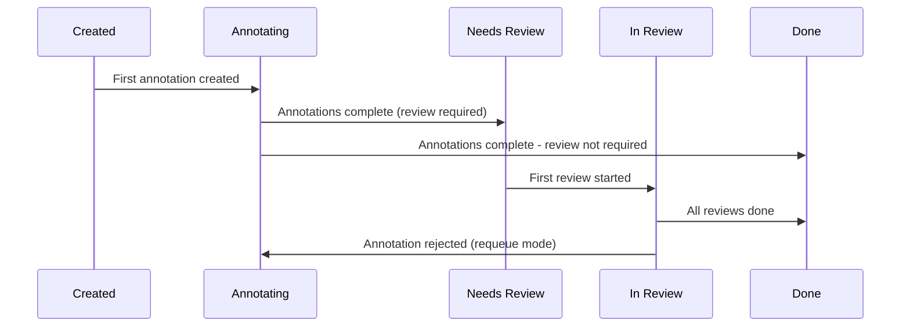
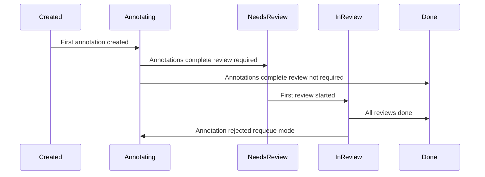
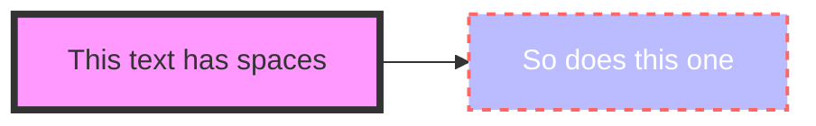

blha

another

beep

blah

!!! note
    note

!!! error
    error

!!! caution
    Caution

!!! warning
    ljljlkj

afadfa

---

## Guide pages by order (title | tier)

Ordering uses `order` and `order_enterprise` from frontmatter (effective order = order_enterprise when order is 0, else order). Tier: **All**, **Opensource**, or **Enterprise**. Pages under `ml_tutorials/` and `release_notes/` are excluded.

| # | Title | Tier |
|---|--------|------|
| 1 | Frontend builds | All |
| 2 | abc | Enterprise |
| 3 | Label Studio overview | All |
| 4 | release notes | Enterprise |
| 5 | Label Studio terminology | All |
| 6 | Compare Label Studio Editions | All |
| 7 | Enterprise features: Label Studio at scale | Opensource |
| 8 | Quick start | Opensource |
| 9 | Installation | Opensource |
| 10 | Installation overview | Enterprise |
| 11 | Requirements to Install and upgrade Label Studio | Opensource |
| 12 | Deploy Label Studio on Kubernetes | Opensource |
| 13 | Deploy Label Studio Enterprise on Kubernetes | Enterprise |
| 14 | Project dashboard | Enterprise |
| 15 | Members dashboard | Enterprise |
| 16 | Set up an ingress controller for Label Studio Kubernetes deployments | All |
| 16 | Set up an ingress controller for Label Studio Kubernetes deployments | All |
| 17 | Install Prompts in an on-prem environment (optional) | Enterprise |
| 18 | Install Label Studio without public internet access | All |
| 19 | Available Helm values for Label Studio Helm Chart | All |
| 20 | Install Label Studio Enterprise On-premises using Docker Compose | Enterprise |
| 21 | Upgrade Label Studio Enterprise | Enterprise |
| 22 | Create backups for on-prem Label Studio Enterprise | Enterprise |
| 23 | Troubleshoot installation issues | Opensource |
| 24 | Set up the database | Opensource |
| 25 | Set up persistent storage | All |
| 26 | Set up email backend for Label Studio Enterprise | Enterprise |
| 27 | Start Label Studio | Opensource |
| 28 | Upgrade Label Studio | Opensource |
| 29 | Configuration details of SaaS | Enterprise |
| 30 | Secure Label Studio | All |
| 31 | Workspaces | Enterprise |
| 32 | Create and configure projects | All |
| 33 | Project and task state management | Enterprise |
| 34 | Configure labeling interface | All |
| 35 | Manage projects in Label Studio | Opensource |
| 36 | Manage projects in Label Studio Enterprise | Enterprise |
| 37 | Project components | All |
| 38 | Project settings | Opensource |
| 39 | Project settings | Enterprise |
| 40 | Use the Data Manager in projects | All |
| 41 | Labeling guide | All |
| 42 | Dashboards | Enterprise |
| 43 | Bulk labeling | Enterprise |
| 44 | Hotkeys | All |
| 45 | Skipping tasks | All |
| 46 | Plugins for projects | Enterprise |
| 47 | Sync data from external storage | All |
| 48 | Set up Amazon S3 cloud storage | All |
| 49 | Set up Google Cloud Storage | All |
| 50 | Set up Microsoft Azure Blob storage | All |
| 51 | Set up Databricks UC volume storage | All |
| 52 | Set up Redis database project storage | All |
| 53 | Get data into Label Studio | All |
| 54 | Set up local project storage | All |
| 55 | Label Studio Task Format | All |
| 56 | Import pre-annotated data into Label Studio | All |
| 57 | Export annotations and data from Label Studio | All |
| 58 | Projects overview dashboard | Enterprise |
| 59 | Member performance dashboard | Enterprise |
| 60 | Prompts overview and use cases | Enterprise |
| 61 | Create a Prompt | Enterprise |
| 62 | Model provider API keys for Prompts | Enterprise |
| 63 | Draft and run prompts | Enterprise |
| 64 | Generate predictions from a prompt | Enterprise |
| 65 | Prompts examples | Enterprise |
| 66 | Integrate Label Studio into your machine learning pipeline | All |
| 67 | Google SAML SSO Setup Example | Enterprise |
| 68 | Ping Federate & Ping Identity SAML SSO Setup Example | Enterprise |
| 69 | Write your own ML backend | All |
| 70 | Set up active learning with Label Studio | Enterprise |
| 71 | Review annotations in Label Studio | Enterprise |
| 72 | Ground truth annotations | Enterprise |
| 73 | Comments and notifications | Enterprise |
| 74 | How task agreement and labeling consensus are calculated | Enterprise |
| 75 | Add a custom agreement metric to Label Studio | Enterprise |
| 76 | Organization management | Enterprise |
| 77 | Activity logs | Enterprise |
| 78 | AI Assistant | Enterprise |
| 79 | Command palette | Enterprise |
| 80 | Organization settings | Enterprise |
| 81 | Usage & License | Enterprise |
| 82 | Support reports - Beta 🧪 | Enterprise |
| 83 | Model provider API keys for organizations | Enterprise |
| 84 | Customize organization permissions | Enterprise |
| 85 | User management overview | Enterprise |
| 86 | Add users to Label Studio | Opensource |
| 87 | Add users to Label Studio Enterprise | Enterprise |
| 88 | Manage user accounts | Opensource |
| 89 | Manage user accounts | Enterprise |
| 90 | User roles and permissions | Enterprise |
| 91 | Manage your user account settings | All |
| 92 | Access tokens | All |
| 93 | SSO, LDAP & SCIM | Enterprise |
| 94 | Set up LDAP authentication for Label Studio | Enterprise |
| 95 | Set up SSO authentication for Label Studio | Enterprise |
| 96 | Set up SCIM2 for Label Studio | Enterprise |
| 97 | How SCIM works with Label Studio Enterprise | Enterprise |
| 98 | API Reference for Label Studio | All |
| 99 | Label Studio Python SDK | All |
| 100 | Set up webhooks in Label Studio | All |
| 101 | Embed Label Studio - Beta 🧪 | Enterprise |
| 102 | Create custom events for webhooks in Label Studio | All |
| 103 | Webhook event format reference | All |
| 104 | Frontend reference | All |
| 105 | On-Premises Release Notes for Label Studio Enterprise | Enterprise |
| 106 | Troubleshooting Label Studio | Opensource |
| 107 | Onboarding guides | Enterprise |
| 108 | How to Annotate in Label Studio | Enterprise |
| 109 | How to Review Tasks in Label Studio | Enterprise |
| 110 | Decommission minio | All |
| 111 | Time series and Video or Audio | All |
| 112 | Troubleshoot labeling issues | All |

